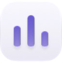
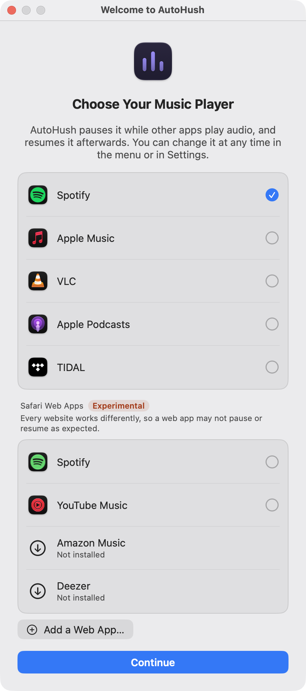
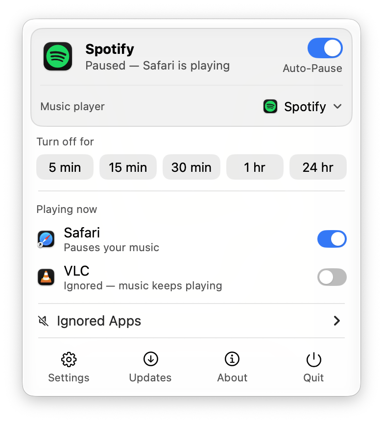
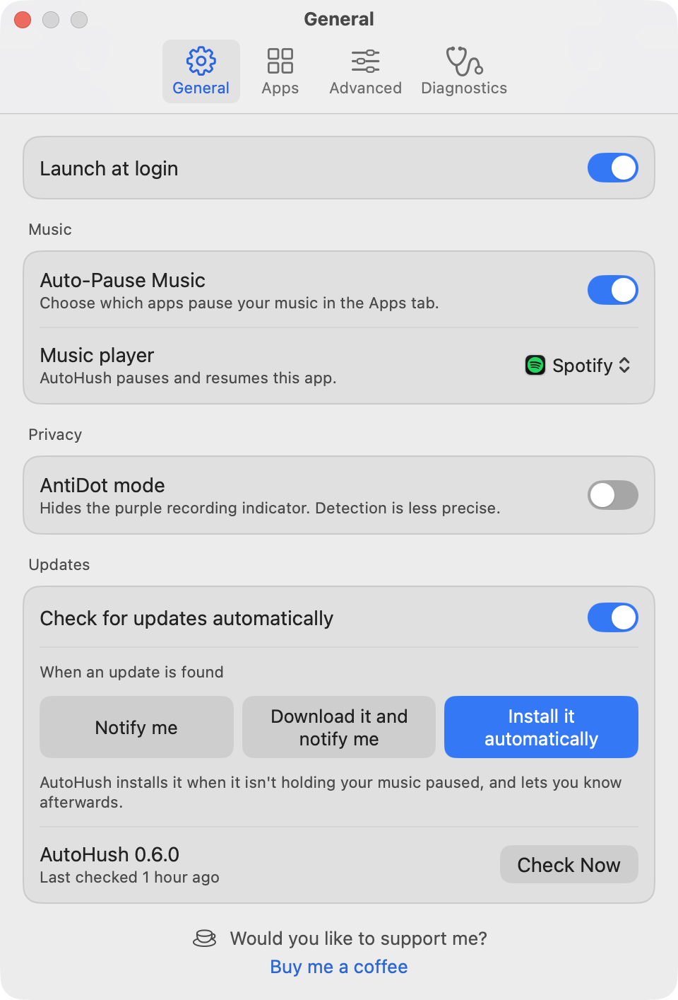

<h1 align="center">
  <picture>
    <source media="(prefers-color-scheme: dark)" srcset=".github/images/icon-dark.png">
    
  </picture>
  <br>AutoHush
</h1>
<p align="center"><strong>Your music steps aside when something else needs your ears.</strong></p>
<p align="center">
  <a href="https://github.com/hfustercabre/AutoHush/releases/latest"></a>
  <a href="https://github.com/hfustercabre/AutoHush/releases"></a>
  <a href="#install"></a>
  <a href="LICENSE"></a>
</p>
<p align="center">
  <a href="https://buymeacoffee.com/hfustercabre"></a>
</p>

## Meet AutoHush

AutoHush is a small menu bar app for macOS. When another app starts making sound (a YouTube video, a call, a game), it pauses your music. When that sound stops, it brings your music back. You don't have to touch anything.

- 🎵 **Automatic:** pauses your music when another app plays, resumes it about 2 seconds after that app goes quiet.
- 🎚️ **Gentle:** the music fades out over 1 second before pausing and fades back in over 2 seconds when it resumes, and your volume is always left as it was.
- 🙋 **Respects you:** if you pause, play or quit your music player yourself, AutoHush takes that as your decision and won't override it.
- 🔕 **Ignores the noise:** notification sounds, alert beeps and short chat tones don't interrupt your music.
- 📱 **Knows where you're listening:** if Spotify plays on your phone, speaker or TV (Spotify Connect), it's left alone.
- 🚫 **Your rules:** choose apps that should never pause your music, or turn Auto-Pause off for a while.
- 🟣 **AntiDot mode:** an option that never shows macOS's purple recording dot.
- 🔒 **Minds its own business:** no accounts, no analytics, no tracking. It never records or saves sound, and it only goes online to check GitHub for updates (more under [Privacy](#privacy)).
- 🪶 **Featherweight:** built to sip, not gulp: about 0.05 % CPU and 15 MB of memory while it waits or your music plays, and well under 1 % while it's working, so your battery won't notice it.

**Works with Spotify, Apple Music, VLC, Apple Podcasts and TIDAL**, and, as an experiment, with music websites added to the Dock from Safari, such as YouTube Music, Amazon Music or Deezer ([Safari web apps](#safari-web-apps)): choose yours in the menu or in Settings.

## Thanks to Background Music

AutoHush was inspired by [Background Music](https://github.com/kyleneideck/BackgroundMusic), the free, open-source audio utility by [Kyle Neideck](https://github.com/kyleneideck) and its contributors. Among many other things, it pauses your music while other apps play, and it did so long before AutoHush existed. My sincere thanks to Kyle for building it and sharing it with everyone: it showed me this could be done, and it's still well worth a look if you also want to set each app's volume.

So why write another one? To get your Mac's sound, Background Music routes it through a virtual audio device and reads it back from there, and macOS counts that as using a microphone. So while it runs, there's a yellow dot in the top-right corner of the screen and a yellow microphone icon in the menu bar, permanently. Nothing is being recorded, and macOS is right to point it out. Still, a yellow dot that never goes away tickles my 'tism in ways I couldn't ignore, so I built AutoHush with a different approach.

AutoHush leaves your sound where it is and only checks which apps are playing. It never uses the microphone, so the yellow dot never shows up. The only dot it ever shows is macOS's purple one, and only while another app plays over your music, which to my eyes is easier to ignore. If it still bothers you, [AntiDot mode](#the-purple-dot-and-antidot-mode) gets rid of it entirely, at the cost of slightly less precise detection.

Yes, this whole app exists because of a yellow dot.


## Contents

- [Install](#install)
- [First launch](#first-launch)
- [Using AutoHush](#using-autohush)
- [The purple dot and AntiDot mode](#the-purple-dot-and-antidot-mode)
- [Tips and troubleshooting](#tips-and-troubleshooting)
- [Privacy](#privacy)
- [Updates](#updates)
- [Uninstall](#uninstall)
- [Support AutoHush](#support-autohush)
- [For developers](#for-developers)

## Install

You need **macOS 15 or later** and one of the supported players: **Spotify**, **TIDAL** or **VLC** (their desktop apps), **Apple Music** or **Apple Podcasts** (the Music and Podcasts apps that come with macOS), or a **Safari web app**, such as YouTube Music, Amazon Music or Spotify's web player added to the Dock from Safari (see [Safari web apps](#safari-web-apps)).

AutoHush is free and isn't sold through Apple. It's signed, but not *notarized* by Apple, because notarization needs a paid developer account. All that means for you is one extra confirmation the first time you open it, and Homebrew handles even that.

### With Homebrew (easiest)

```bash
brew install --cask hfustercabre/tap/autohush
```

This adds AutoHush's own tap, [hfustercabre/homebrew-tap](https://github.com/hfustercabre/homebrew-tap), and installs from it.

### By hand

1. Download `AutoHush-<version>.dmg` from the [releases page](https://github.com/hfustercabre/AutoHush/releases).
2. Open it and drag **AutoHush** onto **Applications**.
3. Open AutoHush. macOS refuses the first time, which is expected.
4. Go to **System Settings → Privacy & Security**, scroll down and click **Open Anyway** next to the AutoHush message. You only do this once: AutoHush installs later versions itself.

Prefer the Terminal? This replaces step 4:

```bash
xattr -dr com.apple.quarantine /Applications/AutoHush.app
```

### From the source code

```bash
git clone https://github.com/hfustercabre/AutoHush.git
cd AutoHush
bash Scripts/build-app.sh release
cp -R AutoHush.app /Applications/
open /Applications/AutoHush.app
```

## First launch

AutoHush lives in the menu bar; it has no Dock icon. The first time it opens, it asks which music player to control. If only one is installed, it's already picked: just click **Continue**. A player counts as installed when it's in /Applications, your own ~/Applications or /System/Applications, not when it's elsewhere, such as on the disk image it came from. You can change your choice any time in the menu or in Settings. Updating from 0.3.x? AutoHush keeps controlling Spotify and doesn't ask.

<p align="center">
  <picture>
    <source media="(prefers-color-scheme: dark)" srcset=".github/images/welcome-dark.png">
    
  </picture>
</p>

macOS then asks for these permissions:

| Permission | What it's for | Needed? |
|---|---|---|
| **Control your music player** (Automation) | Pausing and resuming Spotify, Apple Music or VLC. macOS asks for each player the first time you choose it | Yes, for Spotify, Apple Music and VLC |
| **Accessibility** | Pausing and resuming TIDAL, Apple Podcasts and Safari web apps, which can't be scripted: AutoHush presses Play/Pause in TIDAL's Playback or Podcasts' Controls menu, or the web app's own Play/Pause button, and nothing else | Only with TIDAL, Apple Podcasts and Safari web apps |
| **Record system audio** (Screen & System Audio Recording) | Telling an app that's *playing* from one that just has its sound switched on but is silent | Yes, unless AntiDot mode is on (which doesn't use it) |
| **Notifications** | Telling you about updates | Optional |

The audio permission sounds scarier than it is: AutoHush only measures *how loud* other apps are, in memory, and never records or saves anything (see [Privacy](#privacy)). Without it, AutoHush still works, but a paused video may keep your music paused until you close it.

Right after you choose your player, the welcome window lists what it needs, each with a button: **Open Spotify** (macOS asks for Automation only while the player is open), **Allow…** (macOS's own prompt, or the right place in System Settings), or **Use AntiDot Mode Instead**, which needs no audio permission. **Done** unlocks once everything is allowed, and each line ticks by itself as you go. Wherever something else needs a permission (learning a web app, adding one, Settings), it says what's missing, offers the same button, and waits until it's allowed.

If you said no by mistake, the menu, Settings → General and those windows show the button that fixes it. Once you allow it, AutoHush starts by itself within a few seconds. Audio recording switched on in System Settings is the exception: macOS applies it only once AutoHush is opened again, so the button becomes **Reopen AutoHush**. If you take a permission away later, AutoHush notices when another app starts playing or when you open the menu, and asks for it again.

**Start it automatically:** click **Settings** at the bottom of the menu and turn on **Launch at login**.

## Using AutoHush

Click the menu bar icon to see what's going on:

<p align="center">
  <picture>
    <source media="(prefers-color-scheme: dark)" srcset=".github/images/menu-dark.png">
    
  </picture>
</p>

- **The card** shows your music player and what's happening, such as "Playing", "Paused — Safari is playing" or "Playing on another device". Anything that needs your attention shows in orange, with a row under the card to fix it, or a **Retry** button when the player didn't answer. When the player answered with an error ("Can't control TIDAL right now") or refused to pause ("Couldn't pause — Safari is playing"), an ⓘ ends the line: click it to see why. Settings → Diagnostics shows it too, as **Last error**.
- **Auto-Pause**, on the card, turns everything on or off. Turning it off brings back music that AutoHush paused.
- **Music player** unfolds the players to choose from, the most used first; those not on your Mac are dimmed and listed after them, and your Safari web apps come last, under their own heading: the tested ones first (Spotify, YouTube Music, Amazon Music, Deezer), then those of them you haven't added yet, then any other, marked **Untested**. With eight players or more, not counting the ones you haven't added, a search comes first (and in Settings and the welcome window too). The players you didn't choose count like any other app: if one plays, it pauses your music, unless you ignore it.
- **Turn off for** pauses AutoHush itself, from 5 minutes to 24 hours, in one click.
- **Playing Now** lists the apps playing sound, each with a switch: turn it off for an app that shouldn't interrupt your music, such as a game whose soundtrack you don't mind.
- **Ignored Apps** lists the apps you've switched off. Click one to undo.
- **The buttons at the bottom** open Settings, check for updates, open Settings → About, and quit. When an update is available, **Updates** turns blue and a row above the buttons offers to install it.
- **The menu bar icon** shows what's happening: sound bars while your music plays, a dot and a pause sign when AutoHush paused it, three dots when nothing plays, an arrow when it plays on another device, hollow bars while starting, and "!" when something needs your attention. It's dimmed while Auto-Pause is off.

### Safari web apps

Any website you add to the Dock from Safari (open it, then **File → Add to Dock**) can be your music player: YouTube Music, Amazon Music, Spotify's web player, or any other. AutoHush lists your web apps under **Safari Web Apps** wherever it offers players. Support for them is **experimental**, and says so: every website works differently, so a web app may not pause or resume as expected. AutoHush has been tested with **Spotify, YouTube Music, Amazon Music and Deezer**: their web apps are listed first. Any other web app is listed after them, marked **Untested**: it may work just as well, but nobody has checked. A tested site's web app is listed under the site's name ("YouTube Music", whatever Safari called it), and any other under its page's title without the slogan after " | " or a dash.

AutoHush can make one for you, too: choose **Add a Web App…** (last among the players in the menu, last in Settings' player pop-up, or in the welcome window) and paste the website's address. The tested sites, Spotify, YouTube Music, Amazon Music (your country's site) and Deezer, are listed with a download symbol until you add them; choosing one opens the window with its address filled in. AutoHush checks the address and asks the site once whether it answers, then opens it in Safari. Once the site shows there, click **Add to Dock** in AutoHush's window: AutoHush uses Safari's own **Add to Dock** (keeping the name Safari suggests), chooses the new web app and opens it, and the same window then learns its controls. Safari makes the web app from the page it shows, so if the site asks something first on another of its addresses (YouTube's cookie page on consent.youtube.com, in Europe, or a sign-in page), an **Answer the site in Safari** step waits until you've answered and the site itself shows. Answer anything else it asks (a cookie banner) before clicking Add to Dock. A website that already has a web app isn't added again. If a Safari extension asks for access to the site while it opens, answer it first: Safari can't add the site while it waits. **Cancel**, or closing the window, stops it before anything is added (Safari's dialog is cancelled too); once added, the Safari tab AutoHush opened is closed (its window, when it's the only tab there). Adding it this way needs the **Accessibility** permission, as controlling it does.

Web apps can't be scripted and have no playback menu, so AutoHush presses the site's own Play/Pause button, and the site stays in step. Sites differ, and their buttons are named in the site's language, so AutoHush learns the button with you: when you choose a web app, a window asks you to **play a song in it** and click **It's Playing**. AutoHush then pauses it itself with the keyboard's Play/Pause key (**Let AutoHush pause it**), sees which button changed, and plays it again. If that doesn't take (macOS sends the key to the app it counts as playing, which can be another one that played last, or the site may ignore it), it presses the key again to undo it and marks the step failed, with **Try Again** and **Pause It Manually**. The latter adds a step: **pause it yourself** and click **It's Paused**; the button that changed between the two is the one (if Accessibility isn't allowed yet, its first step asks for it, and the others unlock once it is). That's all; it closes by itself. Log in to the site first if it asks (a site that needs an account plays nothing until you do), and click It's Playing only once the song itself plays: during an ad, the site's own button may say it's paused. Paused by hand, you have a minute to pause it and click It's Paused (a line under the step counts down); then it starts over. A click AutoHush can't take says why under its step: It's Playing while it can't hear the web app, or can't read its page (it isn't open, has no window, or shows its buttons without their names, as a window macOS reopens at login can: open its window, or close it and open it again), or It's Paused while no button has changed. If you close the window with **Later**, the same steps and buttons show under the card in the menu and in Settings until you've done them. Until it knows the button, AutoHush presses nothing on the page.

- It works with the web app's window visible, minimized, or on another Space (another desktop). With more than one window of the same web app, AutoHush follows the one that plays. Closing the window stops the music, as it does in Safari.
- It needs the **Accessibility** permission, and pauses and resumes without fading.
- **When a site won't pause,** AutoHush mutes the web app instead: during an ad that can't be paused (the site disables its button, or the button reads "Play" while the ad plays, as on YouTube Music), or when a press doesn't take. As soon as the site can be paused (the ad is over and the music plays), AutoHush pauses it and unmutes it, so you don't miss any of the music, and plays it when the other app stops. It never mutes a web app that paused. Muting uses macOS's own per-app audio taps, so it needs the audio permission and isn't available in AntiDot mode.
- If the site changes so much that the button can't be found for a minute while the web app plays, AutoHush asks you to tell it once more when it plays and when it's paused, and remembers both layouts. A page that isn't playing doesn't count: a fresh YouTube Music window shows its player bar only once something plays.
- **If AutoHush pauses or resumes a web app at the wrong times,** it may have learned the wrong button, or its words the wrong way round: **Learn Controls Again…** (under the players in the menu and in Settings' player pop-up) or **Learn Again** in Settings → General's **Controls** row forgets it and asks you once more to tell it when the web app plays.
- Deleting the chosen web app leaves no player chosen, and AutoHush asks you for one: adding the site again makes a new web app, which learns its button again.
- **Settings → Diagnostics** shows whether the button has been learned.

### Settings

<p align="center">
  <picture>
    <source media="(prefers-color-scheme: dark)" srcset=".github/images/settings-dark.png">
    
  </picture>
</p>

| Tab | What you'll find |
|---|---|
| **General** | Launch at login · **Music:** Auto-Pause Music and your music player · **Privacy:** [AntiDot mode](#the-purple-dot-and-antidot-mode) · **Updates:** automatic checks, what happens when an update is found (see [Updates](#updates)), and Check Now · a link to support AutoHush |
| **Apps** | Every app that has played sound, each with a **Pauses Music** switch, sorted by **Last Played** (the default), **Name** or **On/Off**; the arrow beside **Sort by** reverses the order, and the magnifier searches the apps by name. The tab grows with the list, up to Advanced's height. **Ignore Another App…** adds one before it ever plays. Click an app and **Remove** takes it off the list (an app you turned off asks first, since it would then pause your music again), or use **Reset List…** to start over |
| **Advanced** | **Detection:** how long an app must play before your music pauses (0.5 s), how long it must be quiet before your music resumes (2 s, at least 1 s), and what counts as silence (−60 dB) · **Fades:** a switch that turns them on or off, then, while it's on, how long the music fades out before pausing (1 s) and back in when it resumes (2 s), where 0 turns one fade off; dimmed with a player that can't fade (TIDAL, Apple Podcasts, Safari web apps) · **Restore Defaults** |
| **Diagnostics** | What AutoHush sees right now: how it's doing, every app with its sound on and how it judges it (playing, ignored, silent) and why, then your music player (with its last error, and for TIDAL and Apple Podcasts whether their own words for Play and Pause could be read), the detection and its timings, each permission and whether it's allowed, AutoHush's own settings, and your Mac. Each part folds away under its heading. **Copy Report** copies it all, to send with a bug report |
| **About** | AutoHush's version, what it does and the players it works with, links to GitHub, the release notes and a new issue, and a link to support AutoHush |

### Language

AutoHush speaks 35 languages: English, Spanish (Spain and Latin America), Catalan, German, French (France and Canada), Italian, Portuguese (Brazil and Portugal), Dutch, Swedish, Danish, Norwegian, Finnish, Polish, Czech, Slovak, Hungarian, Romanian, Croatian, Slovenian, Greek, Ukrainian, Russian, Turkish, Arabic, Hindi, Indonesian, Vietnamese, Japanese, Korean and Chinese (Simplified, Traditional, and Traditional for Hong Kong). In Arabic it reads right to left. It uses the first of your Mac's preferred languages that it has (System Settings → General → Language & Region), and English otherwise. To give AutoHush a language of its own, add it to the Applications list in that same pane.

> [!WARNING]
> Only English, Spanish (Spain) and Catalan have been checked by a native speaker. The other languages were translated automatically, so they may contain mistakes or odd wording. If you spot one, please [open an issue](https://github.com/hfustercabre/AutoHush/issues) with the text and a better wording.

## The purple dot and AntiDot mode

To hear whether another app is *really* playing, AutoHush has to measure its sound level. Whenever an app does that, macOS shows a **purple dot** in the menu bar. It's a privacy feature that no app can hide, and that's a good thing.

AutoHush keeps the dot to a minimum: it only measures while the answer matters, that is while your music is playing on this Mac (or was paused by AutoHush) and another app has its sound on. Your music player itself is never measured. So:

- Your music playing on its own, paused, or on another device: **no dot**.
- Another app playing over your music: the dot shows while that app has its sound on, plus 2 seconds.

**If the dot bothers you, turn on AntiDot mode** (Settings → General). AutoHush then never measures any sound, so the dot never appears. Instead, it goes by what apps tell macOS: most players and browsers say "I'm playing, don't go to sleep" while they play, and stop saying it when you pause. It needs no extra permission, and treats every app the same way.

The catch is that it's a little less precise (measured on macOS 27):

| | Normal mode | AntiDot mode |
|---|---|---|
| Purple dot | Sometimes, while needed | Never |
| Music pauses for a video | After 0.5 s | After 0.5 s (3 s in apps that don't say when they play, like QuickTime) |
| …for sound without video | After 0.5 s | After 3 s, so that notification sounds don't pause it |
| Music comes back after you pause Firefox | ~2 s | ~2 s |
| …Chrome | ~2 s | ~4.5 s (Chrome keeps saying it plays for 2.5 s) |
| …a Safari video | ~2 s | ~2 s once AutoHush has seen Safari play a video in the background, ~9.5 s before that |
| …QuickTime, or Safari playing sound without video | ~2 s | ~9.5 s (they don't say when they play, so AutoHush waits for them to switch their sound off) |
| A notification sound in an app that doesn't say when it plays | Ignored | Pauses the music for about 10 s |
| An app that never says it's playing and keeps its sound on while paused | Music comes back | Music stays paused until you close that app |
| A muted video | Music comes back | Music comes back in Chrome and Firefox, stays paused in other apps |

AntiDot mode offers two ways to detect playing apps: **What apps tell macOS** (recommended), as described above, or **Open audio streams only**, where any app with its sound switched on counts as playing, even when paused: simpler, but stricter.

## Tips and troubleshooting

- **Your music doesn't come back after VLC.** VLC has its own setting that pauses Spotify and Apple Music, and AutoHush only resumes music that it paused. Set **VLC → Settings → Interface → Control external music players** to **Do nothing**, and let AutoHush do the job.
- **I paused my music myself and it stayed paused.** That's on purpose: AutoHush only resumes music that *it* paused.
- **Your music stayed paused after the Mac slept.** That's on purpose too, as music players do after a sleep: the other app's sound stops when the Mac falls asleep, which isn't it ending. Play your music again when you want it.
- **Switched players?** Music that AutoHush was holding paused in the previous player stays paused. From then on, that player counts like any other app.
- **TIDAL, Apple Podcasts and Safari web apps pause without fading.** AutoHush can't read or set their volume, so it pauses and resumes them straight away. It notices when you pause or play them yourself (and VLC) within about a second. If an update changes TIDAL's Playback or Podcasts' Controls menu, AutoHush may not be able to control them until AutoHush is updated too.
- **Deezer's app isn't supported, but its web player is.** Choose **Deezer** under **Safari Web Apps** to add it as a [Safari web app](#safari-web-apps). Support for the app was built and tested, but macOS's limits stop it from working. Deezer's app can't be scripted, and it ignores the menu presses AutoHush uses for TIDAL and Apple Podcasts. The only other way is the Play and Pause that Control Center sends, and macOS lets apps like AutoHush send those only to the app in Now Playing: usually the video that just started, not Deezer. If you find a way that works with the app, please [open an issue](https://github.com/hfustercabre/AutoHush/issues) explaining it, or send a [pull request](https://github.com/hfustercabre/AutoHush/pulls). Either way, it has to keep to AutoHush's principle of being as unintrusive as possible: no virtual audio devices or microphones, and nothing that reroutes your Mac's sound.
- **Only one AutoHush runs at a time.** Opening another copy (a newer version, a second install) quits the one that's running, and takes over any pause it was holding. Delete the copies you don't use.
- **Music keeps playing during a video.** Check that the app isn't ignored (menu → Ignored Apps) and that Auto-Pause is on.
- **Music stays paused after a video ends.** Some apps keep their sound switched on after playback. Allow audio recording, or in AntiDot mode close the app or tab.
- **Something looks off?** **Settings → Diagnostics** shows what AutoHush sees (hold **⌥ Option** and click **Settings** in the menu to go straight there), and **Copy Report** copies it for a bug report.
- **"Spotify is not running", a permission warning, or "not responding".** Fix the cause and AutoHush starts by itself: when the player opens, a few seconds after you allow access (audio recording: once you reopen AutoHush), or once the player answers again (it keeps trying, up to once a minute). **Retry** on the card tries again at once.

## Privacy

- AutoHush **never records, saves or sends audio**, and never uses the microphone.
- With the audio permission, it reads other apps' sound only to work out how loud it is, in memory, and throws the rest away. It does the same, for half a second, with a web app that can be heard while its button says it's paused (an ad). In AntiDot mode it doesn't look at any sound at all.
- It only goes online to check GitHub for a new version once a day, to download that version from GitHub, and to check a website you add as a web app (below). You can turn off both (see [Updates](#updates)). Neither leaves a cache or cookies on your Mac, and a downloaded update is kept for at most 7 days.
- Its only notifications are about updates.
- It controls only the music player you chose: Spotify, Apple Music and VLC through the standard macOS automation mechanism, TIDAL and Apple Podcasts by pressing Play/Pause in their Playback or Controls menu, and a Safari web app by pressing the site's own Play/Pause button.
- When you add a web app from its address, it asks that website once whether it answers, without cookies or a cache, before opening it in Safari.
- With a Safari web app, it reads the names of the page's buttons, in memory, to find its Play/Pause button. It keeps only that button's two words ("Play", "Pause", in the site's language) and where the button is, never what you listen to or anything else on the page.

## Updates

AutoHush checks GitHub for a new version once a day. What happens when it finds one is up to you (Settings → General → **When an update is found**):

| Choice | What happens |
|---|---|
| **Notify me** | A notification tells you, and the menu offers to install it |
| **Download it and notify me** | AutoHush downloads it, then a notification tells you it's ready. Installing it takes a second |
| **Install it automatically** (the default) | AutoHush installs it at a moment when it isn't holding your music paused and none of its windows or menus are open, then a notification says it was updated |

Until it's installed, the menu's **Updates** button turns blue and a row above it offers **Install AutoHush** with the new version. Both open a window with what's new and a button to **Download and Install**, or **Install and Relaunch** once it's downloaded; clicking a notification opens it too. Installing swaps in the new version and restarts in about a second. Your settings and permissions carry over, and if AutoHush has your music paused for another app, the new version takes that pause over.

**Notifications:** AutoHush asks for them when it first starts. While they're off, **Notify me** and **Download it and notify me** are unavailable and Settings says so, with a button to turn them on. If one of them was your choice, AutoHush switches to **Install it automatically** and turns automatic checks off, so it installs nothing until you turn them back on. If you reset AutoHush's notifications in System Settings, it asks again.

**Downloads** wait in `~/Library/Caches/com.autohush.AutoHush/Updates`, one at a time. A download is deleted once it's installed or out of date, when you change the choice or turn automatic checks off, or after 7 days (the menu still offers the update). Automatic downloads wait while Low Data Mode is on.

**Before installing**, AutoHush checks that the download matches the checksum GitHub lists for it, that it's the version GitHub announced, that a kept download hasn't changed since, and that the app inside is signed with the same certificate as your copy (the check macOS itself uses to keep AutoHush's permissions), so nothing but a genuine AutoHush gets installed this way.

**Updates** in the menu, or **Check Now** in Settings, checks right away; turn off automatic checks to only check when you ask.

AutoHush can only update itself from a folder it can write to, such as Applications on an administrator account; Settings tells you when it can't. Then update by hand: `brew upgrade --cask autohush`, or download the new version and replace the old one. Versions up to 0.2.0 can't update themselves: update those once by hand.

## Uninstall

1. In Settings, turn off **Launch at login**, then quit AutoHush.
2. Delete `/Applications/AutoHush.app`, or run `brew uninstall --cask autohush`.
3. Optional: delete its settings and caches (including a downloaded update that may be waiting), and forget the permissions you allowed:

   ```bash
   defaults delete com.autohush.AutoHush
   rm -rf ~/Library/Caches/com.autohush.AutoHush ~/Library/HTTPStorages/com.autohush.AutoHush
   tccutil reset All com.autohush.AutoHush
   ```

   With Homebrew, `brew uninstall --zap --cask autohush` deletes the app, its settings and its caches in one go; the permissions still need the `tccutil` line.

4. Optional: to remove AutoHush from System Settings → Notifications, right-click it there and choose **Reset Notifications…**.

## Support AutoHush

AutoHush is free. If it saves your ears a few times a day and you'd like to say thanks, you can buy me a coffee. It helps me keep improving it. The link is also in **Settings → About** and at the bottom of **Settings → General**.

<p align="center">
  <a href="https://buymeacoffee.com/hfustercabre"></a>
</p>

---

## For developers

### How it works

1. **Which apps have sound on.** AutoHush watches CoreAudio's list of audio processes with change listeners, plus a once-per-second resync that only asks the processes with audio running (each question is a round trip to the audio server). Helper processes are grouped under their app (Chrome's helpers count as "Google Chrome") using the process macOS holds responsible for them (`responsibility_get_pid_responsible_for_pid`, a private function resolved at runtime, with a fallback to the enclosing `.app`). Every Safari web app runs Safari's one "Web App" program, so a web app is named by the app it runs as (`NSRunningApplication`), not by its program. A process with no bundle ID of its own (a command-line player such as `afplay` or `mpv`) counts as the app responsible for it, e.g. Terminal; one no app owns, such as a system daemon, doesn't count.
2. **Whether they're actually audible.**
   - *Normal mode:* each app is metered through a private, unmuted CoreAudio **process tap** that computes only its peak level. Taps exist only while a level can change a decision (see the purple dot below); meanwhile an app is judged by AntiDot mode's rule when it's known to tell macOS it plays, so a paused VLC doesn't count just because it keeps its stream open for a minute.
   - *AntiDot mode ("What apps tell macOS"):* no taps. An app holding its own system-sleep **power assertion** (`IOPMCopyAssertionsByProcess`) counts as playing. An app seen doing that before but not now counts as paused, even with its output open. Apps that never hold one count as playing while their output is open. Assertions held on an app's behalf (by `coreaudiod` or `runningboardd`) are ignored. The names of each app's assertions are remembered across launches. An app that uses one name for both a display-sleep and a system-sleep assertion announces only video: WebKit (Safari) keeps the display awake while a video with sound is visible, and the system while it's hidden, but announces nothing for sound without video. Its display assertion then counts too, and it counts as paused only after dropping its assertion while its output stayed open, for at most 10 s (WebKit closes its output 7.5 s after a pause), so its sound without video is still judged by its open output. An app with no display-sleep assertion, so showing no video, must play for 3 s instead of 0.5 s, because Chromium keeps its "Playing audio" assertion for about 2.5 s after even a short sound.
3. **Filtering.** System sounds are played by `systemsoundserverd`, which is excluded outright. An app must be audible for 0.5 s to count as playing (this filters out chat tones) and silent for 2 s to count as stopped (this bridges gaps between tracks).
4. **Deciding.** `PlaybackArbiter` pauses the chosen player when the first app starts, and resumes it as soon as the last one stops, but only if it paused the player itself and the player is still paused. Pauses and resumes run on their own, so new events are handled even while the music fades. A resume the player doesn't answer, or doesn't follow, is tried twice more, a second apart. When the Mac goes to sleep (`NSWorkspace.willSleepNotification`), a pause it holds is forgotten, and nothing is paused or resumed until the Mac is awake: other apps' sound stops as it falls asleep, and a web page can't be pressed then.
5. **Fading.** `VolumeFader` fades the player's own volume logarithmically, in 0.1 s steps: it falls at a steady rate in decibels to 50 dB below the user's volume over 1 s, then the player pauses and its volume is set back while paused; resuming plays from 50 dB below and rises back over 2 s. Each player's `VolumeCurve` turns decibels into its volume number (a cube law for Spotify, linear for Apple Music, both measured; a cube law for VLC, from its source). The user's volume is remembered when a fade starts, so an interrupted fade never leaves it lower: if the other app stops during the fade-out, the music comes back up without pausing; if you pause the player yourself, AutoHush leaves it to you; quitting mid-fade sets the volume straight back. Players without a readable volume pause and play directly.
6. **The players.** Spotify and Apple Music are both scripted with Apple events (`ScriptablePlayers`). Their state arrives as a distributed notification (`com.spotify.client.PlaybackStateChanged`, `com.apple.Music.playerInfo`) and is confirmed with an Apple event right before each pause or resume. Music posts each change twice, the old state first, so a notification that would end AutoHush's pause is checked with the player first. A player plays "on this Mac" only when its own process, or one of its helpers, has output running; otherwise it's on another device (Spotify Connect) and is left alone. VLC is scripted too (`VLCSupport`), with its own vocabulary: `play` toggles, so it's only sent from the opposite state; `playing` and `current time` (−1 without an item) tell playing, paused and stopped apart; and its `audio volume` goes from 0 to 512. TIDAL and Apple Podcasts can't be scripted (`MenuPlayers`): AutoHush presses the first item of their playback menu (TIDAL's Playback, Podcasts' Controls) through Accessibility, found by its ⌘← and ⌘→ items since its title is translated, and only from the opposite state. It reads the state from that item's title, comparing it with the running app's own translations of Play and Pause (TIDAL's `app.asar`, Podcasts' `Localizable.loctable`). VLC, TIDAL and Podcasts announce nothing, so their state is read about once a second (`PolledStateObserver`).
7. **Safari web apps** (`WebAppPlayers`). Each is a template app, `com.apple.Safari.WebApp.<UUID>`, found in ~/Applications and /Applications. A tested site's web app (`TestedWebApp`) is one that starts on that site: its Info.plist's `Manifest.start_url` has the same host, with or without "www." (for Amazon Music, any of its country sites); until one is found, the site is suggested, and any other web app is untested. The other-Spaces search asks at most 1,000 elements and stops after 1 s, so a frozen web app can't hold AutoHush up, and every page element waits at most 0.5 s for an answer. Its sound comes from its own WebKit process, which macOS holds the web app responsible for, so it's the player's output like any player's own process. AutoHush reads and presses the site's Play/Pause button through Accessibility, which WebKit offers for every page. The button is learned once (`PlayPauseLearner`), from two looks at the page: at **It's Playing** (only while the web app can be heard), and once it's paused. AutoHush pauses it itself: it presses the keyboard's Play/Pause key (`PlayPauseKey`, a system-defined `NSEvent` posted to the HID event tap, which needs Accessibility), which macOS sends to the app it counts as playing now, the web app while its song plays, and reads the page every 0.5 s for 3 s; a change is read again 0.5 s later, since a song's own button can change before the player bar's. Once learned, the learned button plays it again. With no change (the key went to another app that played last, or the site ignores it), the key is pressed again to undo it, and the step is marked failed: **Try Again** takes a new look while it plays and tries the key again; **Pause It Manually** takes a new look, then the user pauses it and clicks **It's Paused**, within `LearningStatus.pauseWait` (a minute; then it starts over). The buttons whose names changed between the two are candidates: the name while it played is the pause button's, the one after is the play button's. Nothing is guessed from the sound, so an ad before the song (YouTube Music's bar says "Play" meanwhile), a player bar that comes only once something plays, and a Mac slow to read the page don't matter, as they did when the button was learned by watching. The song's own button and a playlist's ("Play <playlist>") change along, so the barest names win, then the lowest button in the window, since players keep their controls at the bottom. While it learns, the page is read only at It's Playing, during the key's 3 s, and at It's Paused. The recipe (`PlayPauseRecipe`) keeps the two names and where the button is: the kinds of element around it (not their names, which are translated) and its distance from the window's bottom. A reload makes every element new, so the button is found again by its names at that place, never by its names alone: another "Play" would start other music. **Learn Controls Again…** forgets the recipe (and lifts a mute standing in for a pause) before learning afresh, so nothing of a wrong one is kept. Each window has its own page, so two windows of a web app have two such buttons in the same place: the one saying the music plays wins, and while the one in use says it's paused but the web app can be heard, the other windows are looked at again (every 2 s at most), so music moved to another window is followed there. Windows on another Space aren't in Accessibility's window list, so they're reached through `_AXUIElementCreateWithRemoteToken`, a private function window managers use (`AccessibilityWindows`). The state is read about once a second from the button's name, which the page has to answer, so while the web app is silent and its button says it isn't playing, only every 5 s (at once when its sound comes on, and always right before a pause or a resume); a press is checked to have changed it. With no window, the page is looked for again after 5 s, then twice as long each time, up to a minute, or at once when the web app's sound comes on. **Add a Web App…** (`SafariWebAppMaker`) checks the address (`WebAddress`: http or https, a host with a dot, "https://" added when missing), asks the site with one HEAD request (GET when HEAD is refused; any answer but 404 or 410 counts), opens it in Safari and waits until the page has loaded. Safari makes the web app from the page it shows, so it then waits for the site itself (`WebAddress.isSameSite`: the host typed, with or without "www.", a part of a bare address typed, or the same service's site for another place: the same first two parts of the host followed only by com, a country's code alone or after co or com, such as "es", "co.uk" or "com.br", or the ending of a region or city, such as "cat" or "berlin"); another host of the same domain is the site asking something first (consent.youtube.com for music.youtube.com, accounts.spotify.com for open.spotify.com), looked at again every second while the user answers it. Then it waits for the user's **Add to Dock**, checks the page is still the site, brings Safari to the front (it opens its dialog only while it's the active app, and its menu is looked up again once it is: a menu item found before doesn't open it), and presses Safari's File menu item and the dialog's Add button through Accessibility. They're found by their identifiers, the same in every language (`AddToDock`, `AddToDockFormAddButton`…); the dialog's address is set back to the one typed if the page moved, though Safari on macOS 27 ignores an address set through Accessibility. Add is pressed 3 s after the dialog opens: it shows a letter for an icon at first and fetches the site's own within about a second, and Add keeps whichever is shown. The new web app is used only once Safari has sealed it with its code signature, about 0.3 s after its Info.plist appears: macOS won't open it before. macOS has no other way to make a web app. A site that refuses to pause (its button disabled, as during an ad, or a press that doesn't take within 2 s) is muted instead with a Core Audio process tap muted while it's read, read by a private aggregate device whose IO block throws the samples away (`ProcessTapMuter`): macOS mutes nothing for a tap that nothing reads. Nothing is kept or rerouted, and removing it unmutes, on resume or when monitoring stops; should the reading stop, the sound comes back by itself. So is a site whose button says it's paused while it can be heard (YouTube Music's reads "Play" during an ad), when another app starts: since a paused page keeps its output open, silent, for seconds, the web app is first listened to for 0.5 s through level taps that exist only meanwhile (`ProcessTapLevelProbe`). While it's muted, its button is read about once a second; once it can pause (enabled, and saying the music plays), it's pressed and the mute removed, so resuming goes on from there.

**The purple dot:** taps exist only while `PlaybackArbiter` says levels can change a decision (auto-pause on, and the player playing here or paused by us), with a 2 s release delay. The player itself is never tapped, except to prove the permission works when TCC can't be read.

**The audio permission:** macOS has no public API for it, and taps without it simply deliver silence. AutoHush reads it through the private `TCCAccessPreflight` / `TCCAccessRequest` (resolved at runtime, in `AutoHushKit/PrivateAPI`), re-checks it every 5 s, and falls back to "any open output counts" when it's denied. If a future macOS removes those functions, it infers the permission from tapped samples instead.

### Architecture

```text
AppDelegate ── lifecycle, bootstrap (launch, automatic retries, player relaunch), wiring features to the engine
  ├── StatusMenuController ── renders AppStatus into the menu bar item and menu
  ├── SettingsWindowController ── SwiftUI tabs backed by SettingsModel
  ├── UpdateController ── daily and manual checks against the latest GitHub release, then notifying, downloading (UpdateDownloads) or installing (UpdateInstaller), with notifications (UpdateNotifier)
  └── MonitoringPipeline ── one per bootstrap, started and torn down as a unit
        PlayerStateObserving ── the player's state (distributed notification, quit) ─┐
        AudioMonitor                                                                 │
          ├── HALAudioProcessSnapshotProvider: process list + is-running listeners   │
          ├── ProcessTapLevelMeter: per-app peak level (normal mode)                 │
          ├── IOKitPowerAssertionReader: who says "I'm playing" (AntiDot mode)       │
          ├── SourceActivityTracker: start confirmation + stop grace                 │
          └── ordered source events + "music plays on this Mac" ────┐                │
                                                                    ▼                ▼
                                                              PlaybackArbiter
                                                                ├── pauses the player on the first app
                                                                ├── resumes after all apps stop
                                                                ├── VolumeFader: logarithmic fades around both
                                                                └── MusicPlayer (ScriptablePlayer: Apple events; MenuPlayer and SafariWebAppPlayer: Accessibility)
```

AutoHush is a Swift package of several modules, so the compiler keeps the layers apart:

```text
AutoHush (executable: the entry point only)
  └─ AutoHushApp            the app: menu bar, Settings, updates, diagnostics, wiring
       ├─ AutoHushPlayers   the supported music players
       │    ├─ SpotifySupport, AppleMusicSupport, TidalSupport, PodcastsSupport, VLCSupport
       │    │                   one <App>Support module per player
       │    ├─ ScriptablePlayers   shared by the players scripted with Apple events
       │    ├─ MenuPlayers         shared by the players controlled through their playback menu
       │    └─ WebAppPlayers       Safari web apps, controlled through the site's own Play/Pause button
       └─ AutoHushKit       the engine: no user interface, no specific player
measure-volume-curve (developer tool, in DevTools/) → AutoHushPlayers, AutoHushKit
listen-to-fades (developer tool, in DevTools/): records a loopback device, measures fades
```

```text
Sources/
  AutoHush/              AutoHushMain (starts AutoHushApp)
  AutoHushApp/
    Main/                AppDelegate (wiring; its web app, permission and Diagnostics parts in
                         AppDelegate+WebApps, +Permissions and +Diagnostics), MonitoringPipeline
                         (the engine for each start), the app-wide state: AppStatus (what the menu shows, with
                         UpdateOffer) and SettingsModel (what Settings and the other windows show), then
                         StatusPresentation (the status's icons and text), AppHealthState, PermissionCenter
                         (reads and asks for the permissions), OtherInstances (quits the copies opened before it)
    MenuBar/             StatusMenuController, StatusMenuModel and Views/ (the menu), MenuBarIcon (drawn in code)
    PlayerChoice/        the welcome window, Learning (the window for a player AutoHush learns, a Safari
                         web app) and AddWebApp (the Add a Web App window)
    Settings/            SettingsWindowController, LaunchAtLoginController, DiagnosticsReport (the Diagnostics
                         tab, and Copy Report's text), Views/ (one per tab: General, Apps, Advanced,
                         Diagnostics, About)
    Updates/             UpdateController, UpdateChecker, UpdateInstaller (download, signature check, swap),
                         UpdateDownloads (the kept download), UpdateNotifier, the update window
    General/             what several features show: PlayerOption (each player and whether it's installed),
                         WebAppsHeading (the web apps' heading, its badges and note), LearningSteps (the steps
                         of learning a player, in the menu, Settings and the windows), PermissionButton,
                         ChecklistStep, CardStyles (the look the menu and Settings share),
                         HostedWindowController (the welcome, learning and Add a Web App windows), AppVersion,
                         AppIcon, InfoAlert, …
  AutoHushKit/
    AudioDetection/      AudioMonitor, SourceActivityTracker, PlaybackSignals (AntiDot mode's judge),
                         ActiveAudioReport (what Diagnostics shows), CoreAudio/ (process list, taps, levels)
    Playback/            PlaybackArbiter, VolumeFader, PlaybackState, AutoPause (the setting and snoozes)
    MusicPlayers/        MusicPlayer (the interface), MusicPlayerCatalog, PlayerState, VolumeCurve,
                         PolledStateObserver (for players that announce nothing), WebAppMaking (making a
                         web app from an address, and the suggested ones),
                         PlayerIconPlaceholder (a player's icon while it isn't installed)
    Permissions/         what's needed and where to grant it
    PrivateAPI/          TCC, ProcessResponsibility, AccessibilityWindows: undocumented macOS functions, resolved at runtime
                         with fallbacks; check them after every major macOS release
    Configuration/       AppConfiguration, TimingSettings, AutomaticUpdates
    Storage/, General/   Preferences; logging and small helpers
  AutoHushPlayers/       SupportedPlayers (the catalog of supported players)
  PlayersSupport/        ScriptablePlayers and MenuPlayers (shared), SpotifySupport, AppleMusicSupport,
                         TidalSupport, PodcastsSupport and VLCSupport: each player's profile or controller,
                         and its placeholder icon; WebAppPlayers: Safari web apps (finding them, learning
                         their button, controlling them)
Tests/                   a test module per module, mirroring its folders (only the player modules' tests
                         name a player), plus AutoHushTestSupport (shared fakes)
DevTools/                tools for developing AutoHush, never part of the app or its disk image; each has
                         a README.md saying what it does and how (DevTools/README.md lists them)
  MeasureVolumeCurve/    measures a player's volume curve
  ListenToFades/         records a loopback device and measures the fades in it
  LoopbackDriver/        AutoHush Loopback, a test-only virtual audio device, with build, install and
                         uninstall scripts
  TestVM/                runs builds, tests and apps in a macOS VM, so live tests don't disturb the Mac
  NoiseMaker/            a test app that plays a tone or a file, as "another app playing"
  PauseCheck/            in the VM, times AutoHush's pause and resume around a Noise Maker sound
  PageButtons/           lists or presses a web page's buttons by name (to drive a web app in tests)
  SoundNow/              lists the apps playing sound right now, the way AutoHush counts them
  MediaKey/              presses the keyboard's Play/Pause key, and tries it on a web app with a person
  UIInput/               clicks, drags and scrolls in the desktop session (prompts, SwiftUI buttons)
  WindowList/            lists an app's windows with their place, to check or capture one
  MemWatch/              samples a process's memory over hours (leak checks)
Resources/               Info.plist, entitlements, AutoHush.icon (the app icon), and Localization/ with the
                         String Catalogs, assembled into the .app by Scripts/build-app.sh
```

**Where things go:**

- **`AutoHushKit`** has no user interface (no AppKit or SwiftUI) and knows no player by name; the app tells it which player was chosen. It can't import the app or a player module, and the compiler enforces that.
- **`AutoHushApp`** holds what you see and use, grouped by feature, plus `Main/`, which starts things, wires the features to the engine and owns the app-wide state (`AppStatus` for the menu, `SettingsModel` for the windows). Features may use the engine, `General/` and that state, not each other: what several of them show lives in `General/`.
- **A player module** (`<App>Support`, in `PlayersSupport/`) holds everything specific to one music app. Apps scripted with Apple events share `ScriptablePlayers`, so their module is just a `ScriptablePlayerProfile`; apps controlled through their playback menu share `MenuPlayers`, so theirs is a `MenuPlayerProfile` and a way to read their words for Play and Pause.
- **`PrivateAPI/`** is the only place that calls undocumented macOS functions.
- **Text people read** lives in the app, never in the engine: mostly in `Main/StatusPresentation.swift`, while Diagnostics gets plain facts from the engine (`ActiveAudioReport`) and words them. Write it as `String(localized:)` or a SwiftUI text, with a `comment:` for translators when the context isn't obvious (see [Translations](#translations)). Logs stay in English.
- **`General/`** folders hold only what several parts of a module need.
- **Access:** types used across modules are marked `package`, visible inside AutoHush but to nothing outside it.

**Adding a music player:** the app and the engine only talk to players through the `MusicPlayer` protocol: its bundle ID and name, a permission check, its live state, `pause()` / `play()`, its volume (for fades; `nil` if it has none) and how that volume maps to loudness (`VolumeCurve`; linear if not given), and a `PlayerStateObserving` that reports state changes. A new player is:

1. a new module, `Sources/PlayersSupport/<App>Support/`, and its tests in `Tests/PlayersSupport/<App>SupportTests/` (both need a `path:` in `Package.swift`). If the app is scripted like Spotify and Music, the module is a `ScriptablePlayerProfile`: its bundle ID and name, the suite code of its pause and play commands (from the `.sdef` in its bundle), its state notification, and any quirk, such as Spotify's volume reading one less than it was set to. If it can't be scripted but has a playback menu with Play/Pause first and ⌘← and ⌘→ items, as TIDAL and Podcasts do, it's a `MenuPlayerProfile`: its bundle ID, name, menu name and how to read its own words for Play and Pause from its bundle. Otherwise it's a type implementing `MusicPlayer`, as `VLCPlayer` does;
2. an entry in `SupportedPlayers.catalog` (and a dependency of `AutoHushPlayers` in `Package.swift`), so it's offered in the menu, Settings and the welcome window;
3. its placeholder icon, a `PlayerIconPlaceholder` in its module (as `SpotifyIcon.swift`): its tile's colors and its mark drawn as a path on a 1000-point tile, shown while the app isn't installed. The catalog's tests check that every player has one;
4. its volume curve, measured with `swift run measure-volume-curve <bundle-id>`.

A music website needs none of this: added to the Dock from Safari, it's offered as a player, and AutoHush learns its Play/Pause button. `MusicPlayerCatalog` takes such players besides the built-in ones (`found`) and the sites it suggests adding (`suggested`); a player that has to learn implements `LearningMusicPlayer`, whose status the app shows, and one that may mute itself implements `MutingMusicPlayer`. Once a music website has been tested live, add it to `SupportedPlayers.testedWebApps`: its web app is then offered first and suggested until added, instead of being marked untested.

Defaults that aren't in Settings, such as tick rates, the gap tolerance and the excluded system processes, live in [`AppConfiguration.swift`](Sources/AutoHushKit/Configuration/AppConfiguration.swift). Any non-empty bundle ID that isn't excluded counts as a media app.

### Build and test

```bash
swift build      # build every module and the developer tools
swift test       # run the tests of every module
bash Scripts/build-app.sh release   # build and sign AutoHush.app
swift run measure-volume-curve      # measure the first player's volume curve (or pass a bundle ID)
```

The tests use mock CoreAudio, level meter, power assertion and player implementations, so they never create real taps, script a real player or trigger permission prompts.

`measure-volume-curve [bundle-id] [volume …]` measures how a supported player's volume number maps to loudness, for its `VolumeCurve`, using the engine's own tap meter. It plays the music for about 50 seconds at changing volumes, prints a table in decibels and the best-fitting curve, then puts the volume and play state back. It needs permission to record system audio.

`listen-to-fades` hears the fades the way you do. Build and install the test-only loopback device (`bash DevTools/LoopbackDriver/build.sh`, then `install.sh`, which asks for an administrator's password and restarts Core Audio; `uninstall.sh` moves it to the Trash), set the Mac's sound output to "AutoHush Loopback", and record while the music fades: `swift run listen-to-fades record 90 fades.wav`. Capture AutoHush's log meanwhile (`log stream --level debug --style compact --predicate 'subsystem == "com.autohush.AutoHush"' > fades.log`: its fade lines are debug-level, which `log show` doesn't keep), then `swift run listen-to-fades analyze fades.wav --log fades.log` prints the music's level through each fade next to an ideal one, and any dropout or jump. Recording a device needs the Microphone permission; only that device is read. While "AutoHush Loopback" is the sound output, everything the Mac plays can be recorded from it like a microphone, by any app allowed to use one: switch the output back when you're done, and uninstall it once you no longer test.

The app icon is `Resources/AutoHush.icon`, an Icon Composer document (Icon Composer comes with Xcode): one layer, `Assets/bars.svg`, on a background that changes with the light and dark appearance. `build-app.sh` compiles it with Xcode's `actool`; without Xcode the app builds with the generic icon. To preview a change without building, use Icon Composer's `ictool` (`Icon Composer.app/Contents/Executables/ictool AutoHush.icon --export-image …`).

### Style guide

[STYLE_GUIDE.md](STYLE_GUIDE.md) describes how AutoHush looks and reads: its layout, text sizes, colors and shared components, how to write its text, and how to check a visible change. Follow it, and update it when a change adds a new pattern.

### Translations

English is the source language and the fallback; [Language](#language) lists the translations and how macOS picks one. They are every European language and the most spoken other languages that macOS itself is translated into. Norwegian is `nb` (Bokmål), which macOS also offers to Nynorsk users. Four languages come in variants, and macOS picks the closest one for each country:

| Language | Variants |
|---|---|
| Spanish | `es` Spain · `es-419` Latin America (Mexico, Argentina, US Spanish…) |
| French | `fr` France (also Belgium and Switzerland) · `fr-CA` Canada, with Quebec's punctuation: no space before `;` `?` `!` |
| Portuguese | `pt` Brazil · `pt-PT` Portugal (also Angola and Mozambique) |
| Chinese | `zh-Hans` Simplified (mainland China, Singapore) · `zh-Hant` Traditional (Taiwan) · `zh-HK` Traditional for Hong Kong (also Macau and Cantonese) |

A variant must translate every string: a missing one shows in English, not in the other variant.

- **Where the text lives:** in `Resources/Localization/`. `Localizable.xcstrings` is a String Catalog with all of the app's text, keyed by the English text; `InfoPlist.xcstrings` has the permission prompts and the copyright line from `Info.plist`. Both names are fixed: `Localizable` is the table macOS reads by default, and macOS translates `Info.plist` only from `InfoPlist`.
- **New text** needs no extra step: write it as `String(localized: "…", comment: "…")` or as a SwiftUI text. `build-app.sh` adds new strings to `Localizable.xcstrings` and marks those no longer used as stale, as Xcode does, then compiles each language into the app. Delete stale strings once you're sure they're gone for good: they are still translated and shipped.
- **Adding a language:** open both catalogs in Xcode, add the language and translate (or edit the JSON), then build. Use the words macOS itself uses in that language (Ajustes, Einstellungen, Réglages…) and its typography (French spaces before `:` and `?`), and keep each `comment` in mind: it says where the text appears. Text not translated yet shows in English. The tests check that every translation keeps its placeholders (`%@`, `%lld`) and that `InfoPlist.xcstrings` matches `Info.plist`.
- **Trying a language:** quit AutoHush, then start it with `AutoHush.app/Contents/MacOS/AutoHush -AppleLanguages '(es)'`.
- **Not translated:** logs, the measuring tool and the disk image's background stay in English.

### Signing and releases

macOS remembers permissions per signing certificate. An unsigned ("ad hoc") build looks like a new app every time, and users would have to grant everything again. So AutoHush is signed with a stable self-signed certificate, **"AutoHush Self-Signed"**, and the hardened runtime.

**One-time setup:**

```bash
bash Scripts/create-signing-certificate.sh
```

This creates the certificate (valid 10 years) in your login keychain. The first build asks to let `codesign` use the key: choose **Always Allow**. Then **back it up**: in Keychain Access, open **login → My Certificates**, right-click "AutoHush Self-Signed", choose **Export…** and save a password-protected `.p12`. If you lose it, installed copies refuse to update themselves to a version signed with another certificate. Everyone would have to update by hand once, and grant the permissions again.

| Script | What it does |
|---|---|
| `Scripts/create-signing-certificate.sh` | Creates the signing certificate (once) |
| `Scripts/build-app.sh [release\|debug]` | Builds and signs `AutoHush.app` (`VERSION` / `BUILD_NUMBER` override the bundle version) |
| `Scripts/build-dmg.sh [version]` | Packages `dist/AutoHush-<version>.dmg`: a drag-to-Applications window in AutoHush's colours, with a first-launch note, drawn by `Scripts/lib/dmg-background.swift` and laid out by [dmgbuild](https://github.com/dmgbuild/dmgbuild) (`Scripts/lib/dmg-settings.py`), without Finder. dmgbuild is installed on first use into `.build/`, pinned and hash-checked (`Scripts/lib/dmgbuild-requirements.txt`); it needs Python 3.10 or later (`PYTHON` picks one) |
| `Scripts/release.sh <version>` | Prepares a release: version and changelog, tests, signed build, DMG and release notes. It refuses unsigned builds and never commits, tags or publishes |
| `Scripts/update-tap.sh <version>` | Points the Homebrew tap at a published release: checks that the DMG on GitHub is the one in `dist/`, then commits the new version and checksum to the tap's cask and pushes it |

The signing identity is `SIGNING_IDENTITY` if set (`-` means ad hoc), otherwise "AutoHush Self-Signed" if it exists, otherwise ad hoc. `SIGNING_KEYCHAIN` points to another keychain (for example on CI). Ad-hoc builds reset AutoHush's permissions so macOS asks again; `KEEP_PERMISSIONS=1` skips that.

**Publishing a release:** run `bash Scripts/release.sh <version>` and follow the steps it prints: commit `Resources/Info.plist` and `CHANGELOG.md`, tag `v<version>` and push, create the GitHub release with the DMG and the generated notes, then run `bash Scripts/update-tap.sh <version>` for Homebrew. Installed copies find the release at their next daily check: they compare its tag with their own version and install `AutoHush-<version>.dmg`. So the tag must match the app's version, and the DMG must keep its name and be signed with the same certificate.

The Mac App Store and Homebrew's official cask repository aren't options: both require Apple notarization, and the App Store would also reject the private functions AutoHush relies on.

## License

[MIT](LICENSE)
